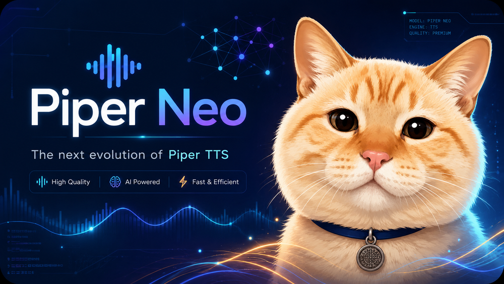

<p align="center">
  
</p>

# Piper Neo

Piper Neo es una versión de [rhasspy/piper](https://github.com/rhasspy/piper), pero con esteroides: conserva el enfoque local-first de Piper TTS, pero agrega mejor CLI/servidor, manejo seguro de textos largos, paquetes de voz `.neo`, control de recursos y un core C++ más ordenado.

Este repositorio se enfoca solo en el motor Piper Neo: CLI C++, API HTTP local, empaquetado de modelos, normalización de texto, utilidades Python de entrenamiento/runtime y documentación. Las aplicaciones de escritorio o clientes externos no forman parte de este repo público.

## Características principales

- Síntesis de voz local con modelos Piper clásicos `.onnx`.
- Paquetes de voz Piper Neo en un solo archivo: `.neo`.
- Entrada directa con `--text`.
- Entrada desde archivo UTF-8 con `--input_file` / `--input-file`.
- Particionado inteligente UTF-8 para textos largos.
- Mejor soporte para español latinoamericano: acentos, `ñ`, `¿?`, `¡!` y signos de puntuación.
- Escritura WAV progresiva para entradas largas.
- Servidor HTTP local con `--server`.
- Carpeta de modelos con `--models`.
- Selección de modelo por petición en la API JSON.
- Token API opcional desde `--api-token`, variables de entorno o `.env`.
- Configuración automática de CPU, RAM, cola, workers y réplicas.
- Scheduler justo por chunks para que un texto largo no bloquee todo el motor.
- Límites de temporales y limpieza automática.
- Endpoints de metadata sin exponer rutas absolutas internas.
- Normalización de texto configurable por modelo para URLs, correos, moneda, porcentajes, versiones y reemplazos.

## Alcance del repositorio

Incluye:

```text
src/cpp/          Motor C++, CLI, API, servidor y paquetes .neo
src/python/       Utilidades de entrenamiento heredadas de Piper
src/python_run/   Utilidades runtime Python heredadas de Piper
script/           Scripts de build y smoke checks
TTS/bin/          Helper de resampling para datasets
docs/             Documentación técnica
contexto/         Contexto técnico actual para mantenimiento
neo-docs/         Notas del formato .neo
notebooks/        Notebooks de entrenamiento/inferencia
models/           Placeholder para voces locales; los modelos reales se ignoran
```

No incluye:

```text
apps/             Apps de escritorio/UI eliminadas del repo público del motor
build*/dist*/     Salidas locales de build ignoradas
models/*.onnx     Voces descargadas localmente ignoradas
outputs/          Audios generados por API ignorados
```

## Uso rápido CLI

Generar desde texto directo:

```bash
./piper --model models/es_MX-voice.onnx   --text "Hola México, ¿cómo estás?"   --output_file saludo.wav
```

Generar desde archivo UTF-8:

```bash
./piper --model models/es_MX-voice.onnx   --input_file texto.txt   --output_file salida.wav   --cpu-threads 2
```

Usar un paquete `.neo` directamente:

```bash
./piper --model models/es_MX-Veritasium.neo   --text "Hola desde Piper Neo"   --output_file hola.wav
```

## Uso rápido API

Iniciar el servidor local con auto-configuración de recursos:

```bash
./piper --server --models models
```

Ejemplo local recomendado:

```bash
./piper --server   --models models   --host 127.0.0.1   --port 8080   --cpu-profile auto   --output-retention-seconds 3600
```

Generar TTS:

```bash
curl -X POST http://127.0.0.1:8080/api/v1/tts   -H "Content-Type: application/json"   -d '{"model":"es_MX-voice.onnx","text":"Hola México, ¿cómo estás? ñ á é í ó ú"}'
```

Descargar el audio desde el campo `url` devuelto por la API:

```bash
curl http://127.0.0.1:8080/api/v1/files/tts_xxx.wav --output audio.wav
```

## Endpoints API

- `GET /api/health`
- `GET /api/v1/status`
- `GET /api/v1/metrics`
- `GET /api/v1/models`
- `GET /api/v1/models?include=metadata`
- `GET /api/v1/models?include=technical`
- `GET /api/v1/models/{model}/image`
- `POST /api/v1/tts`
- `GET /api/v1/files/{file}`

Respuestas exitosas:

```json
{
  "success": true,
  "message": "Audio generado exitosamente.",
  "data": {}
}
```

Errores:

```json
{
  "success": false,
  "error": "invalid_request",
  "message": "Descripción del error."
}
```

## Token API opcional

Si no se configura token, el servidor no requiere autenticación.

Configura un token con:

```bash
./piper --server --models models --api-token "secret"
```

```env
PIPER_API_TOKEN=secret
```

Solicitud con token:

```bash
curl http://127.0.0.1:8080/api/v1/status   -H "Authorization: Bearer secret"
```

También se acepta `X-API-Token: secret`.

## Control de recursos

El modo automático está activo por defecto en modo servidor. Detecta CPU affinity, cuota CPU Docker/cgroup y límite de memoria antes de elegir workers, trabajos y réplicas. Estos flags permiten ajustar manualmente:

```bash
--cpu-profile auto|eco|balanced|fast|max
--cpu-threads NUM|auto
--max-concurrent-jobs NUM
--chunk-workers NUM
--max-model-replicas NUM
--queue-size NUM
--queue-timeout-seconds NUM
--max-input-bytes NUM
--max-text-chunk-bytes NUM
--max-temp-bytes NUM
--output-retention-seconds NUM
--models-refresh-seconds NUM
```

## Paquetes Piper Neo (`.neo`)

Un archivo `.neo` contiene:

- payload del modelo ONNX;
- metadata JSON de la voz Piper;
- información de model card;
- imagen/cover opcional;
- metadata de speakers e inferencia.

Las voces clásicas de Piper siguen soportadas:

```text
voice.onnx
voice.onnx.json
```

Exportar una voz ONNX clásica a `.neo`:

```bash
./piper   --model models/es_MX-Veritasium.onnx   --config models/es_MX-Veritasium.onnx.json   --export-neo models/es_MX-Veritasium.neo
```

Imagen opcional:

```bash
./piper   --model models/es_MX-Veritasium.onnx   --config models/es_MX-Veritasium.onnx.json   --neo-image cover.jpg   --export-neo models/es_MX-Veritasium.neo
```

Al usar el servidor API, `models/` puede contener voces `.onnx` y paquetes `.neo`:

```bash
./piper --server --models models
```

## Build

### Build local Windows

Usa el script existente:

```bat
py script\build-windows.py clean
py script\build-windows.py
```

### GitHub Actions

Los workflows públicos están en:

```text
.github/workflows/build.yml
.github/workflows/build-release.yml
```

**Build Piper Neo** corre automáticamente en cada `push`/pull request hacia `main` y solo publica un artefacto del workflow.

**Build Release Piper Neo** es solo manual. Ejecútalo desde la pestaña Actions cuando quieras compilar Windows amd64, crear o actualizar un GitHub Release y subir `piper_windows_amd64.zip`.

### Build CMake genérico

```bash
cmake -S . -B build -DCMAKE_BUILD_TYPE=Release -DPIPER_BUILD_TESTS=OFF
cmake --build build --config Release
cmake --install build
```

### Imagen Docker CLI/servidor

```bash
docker compose -f docker-compose-cli.yml build
```

## Smoke checks

```bash
python3 script/smoke-text-normalizer.py
python3 script/smoke-project-structure.py
cmake -S . -B /tmp/piper-neo-cmake-check -DPIPER_BUILD_TESTS=OFF
cmake -S . -B /tmp/piper-neo-cmake-check-tests -DPIPER_BUILD_TESTS=ON
cmake --build /tmp/piper-neo-cmake-check-tests --target test_neo_package
cmake --build /tmp/piper-neo-cmake-check-tests --target test_text_sanitizer
cmake --build /tmp/piper-neo-cmake-check-tests --target test_markup_parser
ctest --test-dir /tmp/piper-neo-cmake-check-tests -R "test_neo_package|test_text_sanitizer|test_markup_parser|test_http_parser" --output-on-failure
# Después de compilar el binario final, prueba CLI + API con modelos reales:
python script/smoke-piper-binary.py --models models
# También puedes indicar el binario manualmente:
python script/smoke-piper-binary.py --binary dist-winlibs/piper-neo-windows/piper.exe --models models
python script/smoke-piper-binary.py --binary dist-winlibs/piper-neo-windows/piper.exe --models models --stress-api-requests 4
```

## Arquitectura interna C++

El core C++ está dividido por responsabilidades:

- `src/cpp/main.cpp`: punto de entrada mínimo.
- `src/cpp/app/`: parsing CLI, ayuda, validación, configuración, detección de hardware, política de recursos, entorno y modos de ejecución CLI/server/export/síntesis.
- `src/cpp/piper.hpp` y `src/cpp/piper/`: fachada pública compatible, tipos públicos y API del motor.
- `src/cpp/core/`: runtime Piper, carga de voz, inferencia ONNX, chunking UTF-8 seguro, pipeline de síntesis y escritura WAV.
- `src/cpp/server.cpp`: runtime del servidor local, sockets y loop de aceptación.
- `src/cpp/server/`: HTTP, auth, dispatch de rutas, sanitización, modelos, caché/runtime/loader, scheduler TTS, métricas, markup TTS, WAV, jobs y limpieza.
- `src/cpp/server/routes/`: rutas HTTP separadas por responsabilidad: health/status/métricas, modelos/imágenes, archivos generados y síntesis TTS.
- `src/cpp/server/sanitize/`: lógica interna del sanitizer API para UTF-8/Unicode, filtros de contenido y cálculo de riesgo.
- `src/cpp/server/markup/`: parser de markup TTS, opciones JSON, piezas de audio y ensamblado multi-segmento.
- `src/cpp/text_normalizer.cpp` y `src/cpp/text/`: normalización configurable por modelo.
- `src/cpp/neo_model.cpp` y `src/cpp/neo/`: fachada pública y módulos internos para lectura, inspección, extracción y escritura de paquetes `.neo`.

Más detalles en `docs/core-architecture.md` y `contexto/`.

## Documentación

- `README.md`: documentación en inglés.
- `docs/api-server.md`: documentación de la API HTTP.
- `docs/new-piper-usage.md`: uso CLI, archivos de texto y chunking inteligente.
- `docs/resource-management-plan.md`: notas de administración de recursos.
- `docs/text-normalization.md`: normalización de texto por modelo.
- `docs/text-preprocessing.md`: sanitizado server-side para TTS.
- `docs/markup-tts.md`: markup local multi-voz.
- `neo-docs/neo-format.md`: formato de paquete `.neo`.

## Proyecto base

Piper Neo deriva de [rhasspy/piper](https://github.com/rhasspy/piper). Respeta la licencia y atribución del proyecto base al redistribuir binarios o código fuente.


### HTTP modular y catálogo de modelos

El servidor de Piper Neo separa rutas, parser HTTP, socket I/O, respuestas, sanitizer, markup TTS y catálogo/cache de modelos en módulos internos pequeños. Esto permite mantener la API TTS sin convertir `server.cpp` o `request_handler.cpp` en archivos monolíticos.
